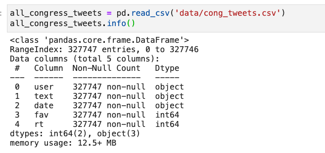
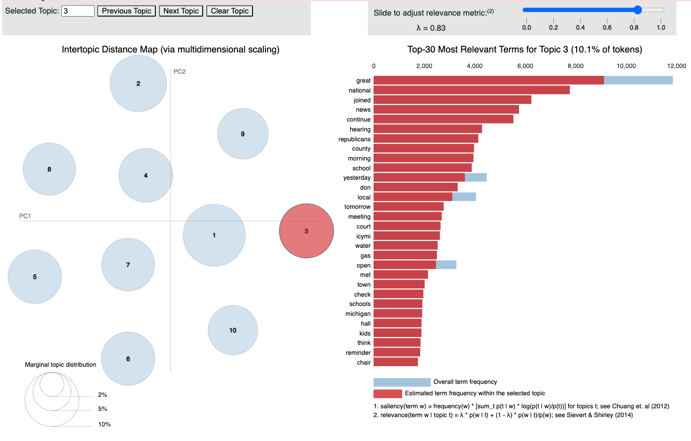
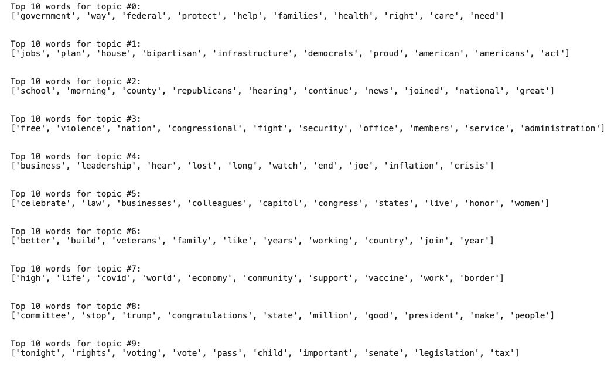
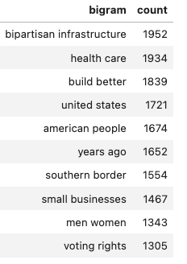
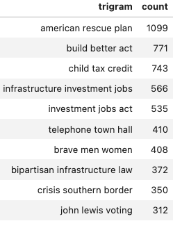

<h1> Using Twitter to Identify Political Platforms </h1>
<h3>Minimum Viable Product (MVP)</h3>

<h2>Introduction</h2>
Twitter is the modern political soapbox. We have all seen it used as a vehicle for both information and mis-information and this project aims to use tweets to identify the Democratic and Republican political platforms for the 2022 midterm elections in the United States using various NLP methods and techniques.

<h2>Design and Methodology</h2>
The initial phase was acquiring the previous 1000 tweets from each member of the House and Senate then loading scraped tweets into a dataframe. Tweets were then limited to January 1, 2021-January 10, 2022. 

Cleaned data was used to create a corpus which was then fed into an baseline model using LDA topic modeler. pLDAvis was used to visualize the resulting modeled topics.

Modeled topics improved after adding more stopwords to both the sklearn and nltk stop word lists. 

Using sklearns CountVectorizer and TfidfVectorizer, bigrams and trigrams were also generated to create more interpretable topic models.

| Bigrams	| Trigrams 	|
|---	|---	|
|||

Using Bigrams, here are the Democratic and Republican platform topics based on tweet data:

| Democrats	| REpublicans 	|
|---	|---	|
|||

<h2>Further Work </h2>
For the final project proposed tasks to complete include:

- additional text cleaning 
- exploration of tweet favorites and retweets for use in feature creation to determine topic 'stickyness' for sentiment analysis
- using other topic modelers on data 
- streamlit app to present results

------------------------------
<h3>submitted by: Mike Bernardo</h3>
